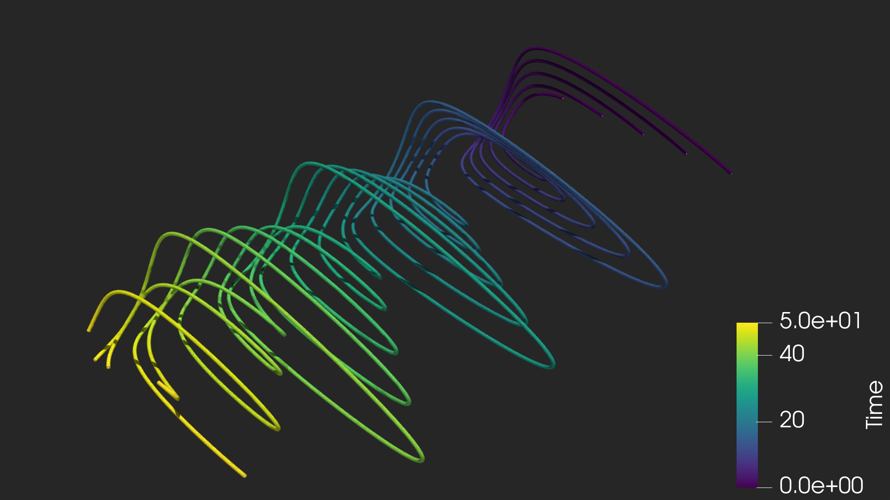

# 3D Visualization of Nonlinear Predator-Prey Dynamics

This project demonstrates a high-end scientific visualization of the **Lotka–Volterra equations**, a system of nonlinear differential equations used to describe the dynamics of biological systems in which two species interact.

## The Project
I developed a pipeline to solve the ODEs in Python and visualize the resulting phase-space trajectories in **ParaView**. By mapping population counts to spatial coordinates and Time to the Z-axis, the cyclical nature of the ecosystem is revealed as a 3D spiral.

### Technical Stack
*   **Math/Simulation:** Python (NumPy, SciPy)
*   **Visualization Engine:** ParaView 6.1.0
*   **Rendering:** OSPRay Path Tracing (Ray Tracing) for photorealistic shadows and materials.
*   **Scripting:** ParaView Python API (servermanager).

## 📊 Visual Results

*Above: A high-resolution render using OSPRay Path Tracing and a Viridis color-map to represent the passage of time.*

## 📂 Repository Contents
*   `Simulation_logic.ipynb`: The initial Jupyter Notebook used to solve the ODEs and validate the math.
*   `ParaView_Automation.py`: A Python script that automatically builds the 3D tubes, lighting, and environment within ParaView.
*   `Simulation_Orbit.mov`: A cinematic camera orbit of the final 3D model.

## 💡 Key Concepts Demonstrated
*   **Phase-Space Analysis:** Mapping non-spatial data into a 3D geometric context.
*   **Automated Visualization:** Using Python scripts to generate complex 3D scenes.
*   **Professional Rendering:** Utilizing "Principled" materials and ray tracing to communicate data effectively.
